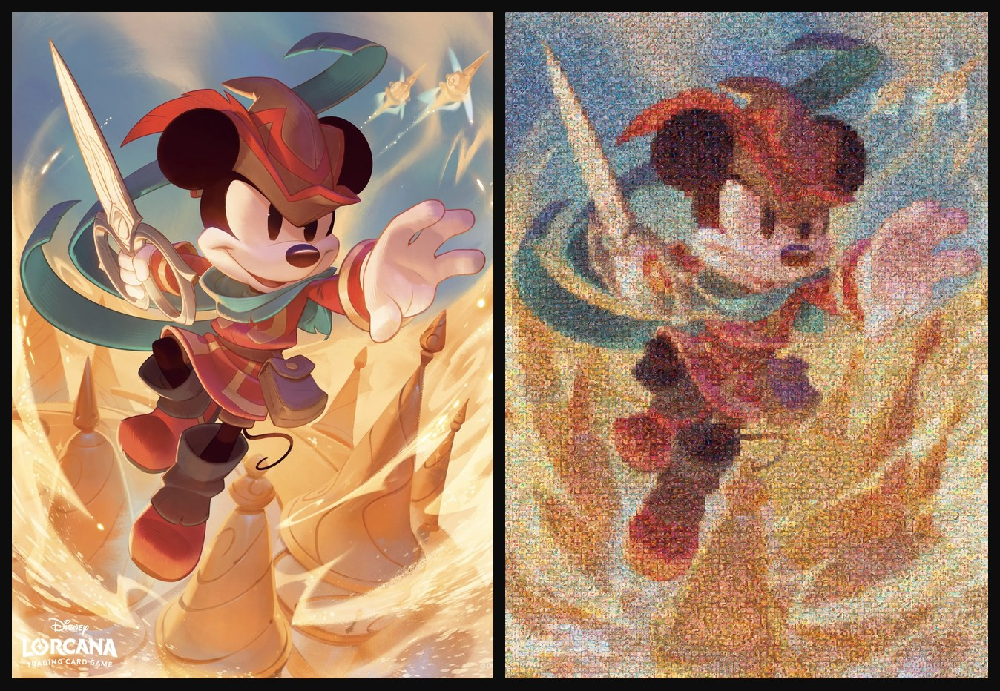
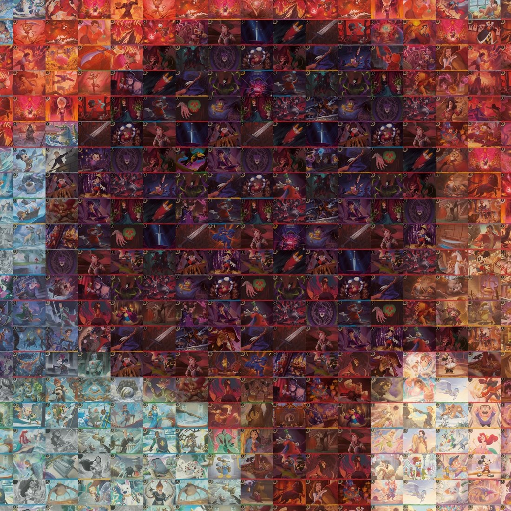

<h1 align="center">lorcana-mosaic</h1>

<p align="center">
  <em>Photomosaics built exclusively from Disney Lorcana card images.</em>
</p>

<p align="center">
  
  
  
  
  
</p>

<p align="center">
  
</p>

<p align="center">
  <sub>Source · mosaic of <b>8,610 cards</b> (70×123 grid, 1,226 distinct cards, mean error 21.1 dE)</sub>
</p>

Images come from the [Lorcast API](https://lorcast.com/docs/api). No card is redrawn or
generated: every tile is a real Lorcana illustration, and the tool can tell you **which
card goes in which cell** and **how big the mosaic would be** if you actually built it
on a wall.

---

## Contents

- [Up close](#up-close)
- [Install](#install)
- [Quickstart](#quickstart)
- [What's different from a classic photomosaic](#whats-different-from-a-classic-photomosaic)
- [How matching works](#how-matching-works)
- [Variety](#variety)
- [Fidelity](#fidelity)
- [Building it for real](#building-it-for-real)
- [The JSON manifest](#the-json-manifest)
- [CLI reference](#cli-reference)
- [Offline test](#offline-test)
- [Project layout](#project-layout)
- [Notes and credits](#notes-and-credits)

---

## Up close

This is the property that makes the project worth doing: from a distance it's Mickey,
up close every tile is a recognisable illustration.

<p align="center">
  
</p>

<p align="center">
  <sub>100% crop from the mosaic above (hat and ear area)</sub>
</p>

---

## Install

With [uv](https://docs.astral.sh/uv/) (recommended):

```bash
uv sync                       # creates .venv and installs everything
source .venv/bin/activate     # or prefix commands with `uv run`
```

Or with pip:

```bash
pip install -r requirements.txt
```

Lorcast images are **AVIF**: you need Pillow ≥ 11.3 (AVIF support included) or
`pip install pillow-avif-plugin`. The program checks and tells you up front if it's
missing.

## Quickstart

```bash
# 1. download the catalog + images into the cache (~/.cache/lorcana-mosaic)
python -m lorcana_mosaic fetch --size small

# 2. build the mosaic
python -m lorcana_mosaic build photo.jpg -o mosaic.jpg \
  --crop art --cols 70 --tile-width 70 --blend 0.35 \
  --tolerance 3 --temperature 1.5 --min-distance 3 --max-reuse 12 \
  --manifest mosaic.json
```

The first command respects the rate limit Lorcast asks for (≈ 100 ms between calls to
`api.lorcast.com`) and downloads images in parallel from the `cards.lorcast.io` CDN,
which has no limit. Everything is cached: catalog, images and colour features. A weekly
refresh is plenty, as the docs suggest.

The full catalog is about **3,300 cards**, ~3,180 of which have a downloadable image.
At `--size small` that's a few minutes and a few tens of MB.

Handy variants:

```bash
# sets 1 and 2 only, Amber and Ruby only
python -m lorcana_mosaic fetch --set 1 --set 2 --ink Amber --ink Ruby

# use Lorcast search syntax
python -m lorcana_mosaic fetch --query "set:1 rarity:enchanted"

# what's in the cache
python -m lorcana_mosaic info
```

## What's different from a classic photomosaic

Same idea as `sausheong/mosaic` and `White-On/Mosaic_Image`, with three substantial
differences driven by the domain:

1. **Tiles aren't square.** Lorcana cards are 1468×2048 (≈ 5:7). The grid uses portrait
   tiles and rows are derived to preserve the source aspect ratio. *Locations*
   (`landscape` layout) are excluded automatically, or they'd break the grid.
2. **The library is small and chromatically concentrated.** A few thousand cards, with
   six ink families dominating the average colour. Without countermeasures, "always take
   the nearest card" collapses onto a handful of cards.
3. **Variety is a first-class parameter**, not a side effect.

## How matching works

Every card and every grid cell is reduced to a signature of **3×3 mean colours in
CIELAB** (27 numbers), not a single average colour. That way the comparison accounts for
internal structure too, and a card that's light on top and dark at the bottom isn't
mistaken for a uniform grey one.

Distances are computed with a blocked matmul (`‖a‖² + ‖b‖² − 2a·b`), keeping only a
shortlist of the best candidates per cell, so memory doesn't blow up on large grids.

`--grid 4` or `5` increases structural precision; `--grid 1` falls back to the classic
single average colour.

## Variety

Four independent mechanisms, all of which can be turned off:

| Option | What it does |
|---|---|
| `--max-reuse N` | Hard cap on uses per card. Default *auto* (≈ 2× the necessary minimum). `0` = unlimited. |
| `--min-distance N` | Forbids the same card reappearing within N cells (Chebyshev distance). With `--repel-by name` (default) the rule applies per *character*, so different versions of the same Elsa don't clump either. |
| `--candidates K` + `--tolerance dE` | Instead of always taking the first match, pick among the K best **that cost at most `dE` per cell** relative to the best one. Variety only enters where it's nearly free. |
| `--temperature T` | Softmax sampling among the allowed candidates (in dE per cell). `0` = always take the best allowed. |

Two implementation details that matter more than they look:

* **Hard cells pick first** (`--order hard-first`). Otherwise skies and walls burn through
  the reuse budget of the few dark cards you need for an eye or a shadow.
* **When constraints are unsatisfiable** for a cell, the fallback searches the whole
  library while still respecting the reuse cap, instead of always falling back to the
  same card. The final report says how many cells needed a relaxation: if that number is
  high, the library is too small for the constraints you asked for.

On top of that, `--dedupe-art 2` drops reprints with identical art (comparing dhash
**and** colour signature, to avoid false positives on very flat illustrations): on the
full catalog it takes the library from 3,180 to 2,869 tiles.

### The trade-off, measured

Real library of 3,180 cards, `--crop art`, 70×89 = 6,230 cells:

| Configuration | Distinct cards | Variety | Mean error |
|---|---|---|---|
| `--tolerance 0 --temperature 0 --min-distance 0 --max-reuse 0` (classic) | 667 | 21% | **16.7** |
| `--tolerance 3 --temperature 1.5 --min-distance 3 --max-reuse 12` | 1,129 | 36% | 23.3 |
| default (`--max-reuse auto`) | 1,832 | 58% | 28.1 |

**Minimum error does not give the best mosaic.** The classic configuration is the
sharpest on the subject, but skies and flat surfaces collapse onto a few cards and you
can see the repeating texture with the naked eye. The middle row costs 6.6 dE more and
removes it — it's the recommended default.

For comparison, on a **synthetic** library of 500 cards (30×29 = 870 cells) the collapse
is far more violent, because there simply isn't enough material:

| Configuration | Distinct cards | Max uses | Mean error |
|---|---|---|---|
| classic | 26 | 473 | 32.3 |
| default (`--max-reuse auto`) | 247 | 4 | 43.7 |
| `--max-reuse 8` | 178 | 8 | 40.6 |
| `--max-reuse 2` | 440 | 2 | 49.8 |
| `--unique` | all | 1 | maximum |

`--unique` looks elegant but is almost always the worst choice: the matcher can no longer
use the right card where it's needed and colour error explodes.

## Fidelity

With a library of a few thousand saturated cards, the "pure" mosaic rarely looks much
like the photo. Two corrections, both standard in photomosaics, both adjustable:

* `--blend 0.35` — overlays each card with a flat tint equal to the cell's mean colour.
  Hugely improves legibility at a distance; the card stays recognisable. Past ~0.35 it
  makes no measurable difference — you're just dimming the cards.
* `--overlay 0.2` — overlays the actual source crop. More aggressive, recovers fine
  detail too.

And above all `--crop`:

| Preset | Window | Effect |
|---|---|---|
| `full` (default) | the whole card | reads as a wall of cards; colour is dominated by the ink frame |
| `art` | `0.06 0.05 0.94 0.55` | illustration only, no frame or text box: much closer to the photo |
| `art-wide` | `0.04 0.04 0.96 0.62` | same idea, more generous window |
| `--crop-box L T R B` | custom | fractions, if you want to tune the window by hand |

For the "collection" look with cards separated: `--gap 3 --bg "#0d0d0d"`.

### How much the subject matters

Not all images work equally well. Same configuration, same library:

| Source | Grid | Mean error |
|---|---|---|
| Card artwork (coherent golden background, warm palette) | 70×123 | **21.1** |
| Promotional key art (saturated multicolour streaks, small details) | 70×89 | 23.3 |

Images with large coherent regions work far better than ones full of saturated
small-scale detail, because the Lorcana library covers warm tones and the ink
purples/blues well, but doesn't have enough material for a rainbow of streaks.

## Building it for real

Every build can report real-world dimensions, computed for **63 × 88 mm** cards
(standard TCG size, same aspect as the Lorcast scans). The command prints them:

```
real size         : 1.66 x 2.29 m visible (shingled, 410 cards/m2)
```

There are two geometries, and the difference is large.

**`--crop full` — whole cards laid edge to edge** (`layout: flat`). The grid pitch is the
card itself, 63 × 88 mm.

**Any crop — cards overlapped like shingles** (`layout: shingled`). With `--crop art` a
55.44 × 44 mm window stays visible, so each card covers 7.56 mm horizontally and 44 mm
vertically of its neighbour, like roof tiles. You mount bottom-to-top and right-to-left.
**No cutting**: cards stay whole, just partly hidden.

| | `--crop full` | `--crop art` |
|---|---|---|
| Grid pitch | 63 × 88 mm | 55.44 × 44 mm |
| Density | 180 cards/m² | **410 cards/m²** |
| Visible card surface | 100% | 45% |

For the same wall, the art crop gives **2.3× the resolution**, at the cost of hiding 55%
of every card and using more pieces.

Dimensions with `--crop art`, for a source in card format:

| Grid | Cards | Visible area | Footprint |
|---|---|---|---|
| 20 × 35 | 700 | 1.11 × 1.54 m | 1.12 × 1.58 m |
| 25 × 44 | 1,100 | 1.39 × 1.94 m | 1.39 × 1.98 m |
| **30 × 52** | **1,560** | **1.66 × 2.29 m** | 1.67 × 2.33 m |
| 40 × 70 | 2,800 | 2.22 × 3.08 m | 2.23 × 3.12 m |

### The real constraint is copies

It isn't space — it's that a card used 12 times needs 12 physical copies. Keep
`--max-reuse` low and the shopping list becomes manageable.

For the 30×52 grid with `--max-reuse 2`: **885 distinct cards**, 210 of them as singles
and 675 as pairs, for 1,560 pieces total and roughly 2.8 kg of cardstock. Mean error
21.2 dE — **identical** to the digital version with no copy limit: with the art crop, the
library is large enough.

```bash
python -m lorcana_mosaic build photo.jpg -o wall.jpg \
  --crop art --cols 30 --rows 52 --tile-width 252 --blend 0.35 \
  --tolerance 3 --temperature 1.5 --min-distance 3 --max-reuse 2 \
  --manifest wall.json
```

> **Pin `--rows` for a physical build.** Without it, rows are derived from the tile's
> pixel aspect and `tile_h` is rounded to an integer: `--tile-width 200` gives 53 rows,
> `8` gives 55. Pinning rows makes the digital grid match the one you'll mount.

## The JSON manifest

`--manifest` writes which card goes in which cell, plus the metadata you need to build
it: cards per side, total cards, and real dimensions in millimetres.

```json
{
 "source": "IMG_6425.webp",
 "cards_per_side": { "cols": 30, "rows": 52 },
 "cards_total": 1560,
 "distinct_cards": 885,
 "crop": { "preset": "art", "box": [0.06, 0.05, 0.94, 0.55] },
 "physical": {
  "card_mm": [63.0, 88.0],
  "cropped": true,
  "tile_mm": [55.44, 44.0],
  "pitch_mm": [55.44, 44.0],
  "gap_mm": 0.0,
  "overlap_mm": [7.56, 44.0],
  "layout": "shingled",
  "visible_mm": [1663.2, 2288.0],
  "total_mm": [1670.76, 2332.0],
  "visible_m": [1.66, 2.29],
  "cards_per_m2": 409.9
 },
 "cells": [
  { "row": 0, "col": 0, "card_id": "crd_b1aa…", "label": "Ohana Means Family [11/32]" }
 ]
}
```

`visible_mm` is the mosaic proper; `total_mm` includes the margins of the outermost cards
that stick out (nothing overlaps them). `--gap` is converted to millimetres based on
`--tile-width`.

## CLI reference

### `fetch` — download data and images

| Option | Default | What it does |
|---|---|---|
| `--query` | — | Lorcast search syntax instead of all sets |
| `--force` | off | re-download the catalog |
| `--workers` | 8 | parallel CDN downloads |

### `build` — build the mosaic

| Option | Default | What it does |
|---|---|---|
| `--cols` | 48 | cards across |
| `--rows` | auto | cards down (default: preserve aspect ratio) |
| `--tile-width` | 120 | px per card in the output |
| `--crop` | `full` | `full`, `art`, `art-wide` |
| `--crop-box L T R B` | — | custom crop as fractions |
| `--grid` | 3 | N×N colour samples per card |
| `--candidates` | 10 | how many matches to consider |
| `--tolerance` | 5.0 | max dE cost accepted for variety |
| `--temperature` | 3.0 | softmax sampling (`0` = always the best) |
| `--order` | `hard-first` | which cells pick first |
| `--max-reuse` | auto | max uses per card (`0` = unlimited) |
| `--min-distance` | 3 | no repeat within N cells |
| `--repel-by` | `name` | `name` also spreads versions of the same character |
| `--unique` | off | every card at most once |
| `--dedupe-art H` | 0 | drop near-identical artworks (try `2`) |
| `--blend` | 0.0 | flat colour correction per card |
| `--overlay` | 0.0 | blend the source image over the cards |
| `--gap` / `--bg` | 0 / `#101010` | gap between cards and background colour |
| `--seed` | — | makes sampling reproducible |
| `--manifest` | — | writes the JSON described above |

Global: `--cache DIR` and `--size {small,normal,large}`.
Filters valid on all commands: `--set`, `--ink`, `--rarity`, `--type` (repeatable).

## Offline test

No network needed to try the pipeline:

```bash
uv run tools/make_fake_cache.py --cache /tmp/fakecache --count 500
uv run python -m lorcana_mosaic --cache /tmp/fakecache build photo.jpg -o out.jpg --cols 30
```

This generates a synthetic catalog shaped like Lorcast's (fake cards, six inks, gradient
art) and builds a mosaic on top of it.

## Project layout

```
lorcana_mosaic/
  __main__.py     python -m lorcana_mosaic
  cli.py          argparse, three subcommands
  lorcast.py      API client + image download + cache
  library.py      cards -> tiles: crop, CIELAB features, dhash, dedupe
  mosaic.py       grid planning, matching, constraints, render, physical geometry
  colors.py       vectorised sRGB -> CIELAB conversion
tools/
  make_fake_cache.py   synthetic catalog for offline tests
```

## Notes and credits

* **The images belong to Ravensburger / Disney.** Lorcast distributes them under
  Ravensburger's [Community Code Policy](https://cdn.ravensburger.com/lorcana/community-code-en),
  which expressly forbids charging for access to this content. This is a personal,
  non-commercial project: **don't sell the mosaics** and don't put the output behind a
  paywall. The code is mine, the illustrations are not.
* Thanks to [Lorcast](https://lorcast.com) for a clean, free, public API.
* The API is beta `v0` and unpaginated: `/cards/search` may change. The client uses
  `/sets` + `/sets/:code/cards`, which currently returns everything.
* `--size small` (146×204) is enough for dense grids and much faster to download and
  analyse; `normal` (488×681) is the right compromise for print. With `small`, the art
  crop introduces a 0.5% discrepancy in tile aspect: irrelevant on screen, use `normal`
  if you need millimetre precision.
